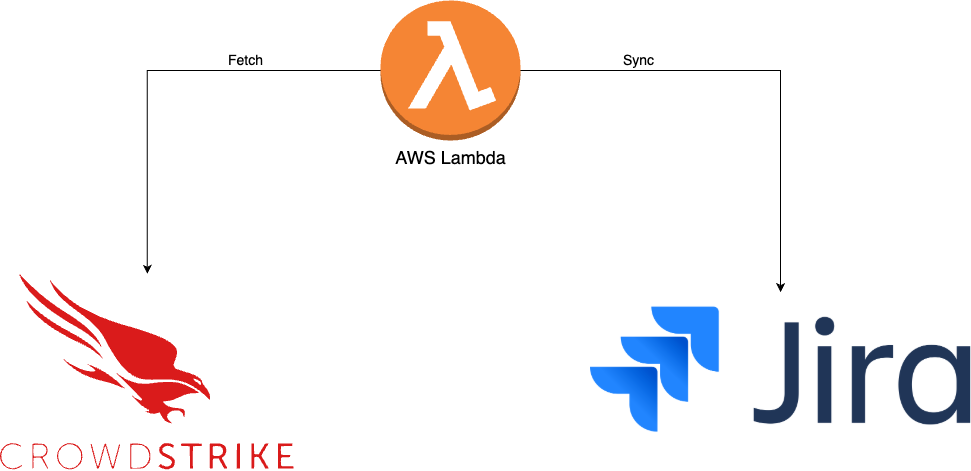

# falcon2jira
A serverless application that enhances the native CrowdStrike-Jira integration by synchronizing additional data between closed CrowdStrike alerts and their corresponding Jira issues.

## Purpose

This tool fills the gaps in the standard CrowdStrike-Jira integration. While the native integration automatically creates Jira tickets when new alerts appear in CrowdStrike, it lacks synchronization for:

- Alert status changes
- Assignee changes
- Comments

This complementary tool addresses these limitations by ensuring that when security teams work within CrowdStrike (closing alerts, reassigning them, or adding comments), these actions are reflected in the corresponding Jira tickets.
## Diagram

## Features

- Automatically updates Jira issue status when CrowdStrike alerts are closed
- Syncs the assignee from CrowdStrike to Jira
- Replicates comments from CrowdStrike alerts to the corresponding Jira issues
- Prevents duplicate comments
- Includes proper attribution for comments (original author and timestamp)
- Designed to run in AWS Lambda

## How It Works

This tool specifically focuses on **closed** CrowdStrike alerts. When it runs, it:

1. Fetches recently closed alerts from CrowdStrike (using filter `status:'closed'`)
2. Finds corresponding Jira issues but are still in "To Do" or "In Progress" status, by searching for the CrowdStrike alert ID in the issue description  
3. Updates the Jira issue status to reflect that the alert is closed
4. Updates the Jira issue assignee to match the CrowdStrike assignee
5. Copies any comments from the CrowdStrike alert to the Jira issue

This workflow ensures that when security teams close an alert in CrowdStrike, the corresponding ticket in Jira is also updated appropriately, maintaining consistency between the two systems.

## Prerequisites

- The native CrowdStrike-Jira integration must be configured and working correctly
- Jira tickets should already be created automatically by the native integration
- This tool is designed to supplement, not replace, the native integration

## Requirements

- Python 3.9+
- AWS Lambda environment
- CrowdStrike API credentials
- Jira API credentials

## Environment Variables

| Variable | Description |
|----------|-------------|
| `JIRA_USER` | Jira username or email |
| `JIRA_TOKEN` | Jira API token |
| `FALCON_CLIENT_ID` | CrowdStrike API client ID |
| `FALCON_CLIENT_SECRET` | CrowdStrike API client secret |
| `ATL_COMPANY_DOMAIN` | Atlassian company domain (e.g., "mycompany" for "mycompany.atlassian.net") |
| `JIRA_PROJECT_NAME` | Jira project key |
| `JIRA_TRANSITION_ID` | ID of the Jira transition to apply (likely the closed state id) |
| `MAX_ALERTS` | Maximum number of alerts to process per execution (default: 5) |

## Installation

1. Clone this repository:
   ```
   git clone https://github.com/yourusername/crowdstrike-jira-sync.git
   ```

2. Install dependencies:
   ```
   pip install -r requirements.txt
   ```

3. Create a Lambda deployment package:
   ```
   pip install -r requirements.txt -t ./package
   cp crowdstrike_jira_sync.py ./package/
   cd package
   zip -r ../deployment_package.zip .
   ```

4. Upload the deployment package to AWS Lambda and configure environment variables.

## AWS Lambda Configuration

- **Runtime**: Python 3.9+
- **Trigger**: CloudWatch Events/EventBridge scheduled rule (e.g., every 15 minutes)

## Dependencies

- `requests`: For HTTP requests to Jira's REST API
- `falconpy`: Official CrowdStrike API client for Python

Required Python packages:
```
requests==2.31.0
falconpy==1.2.13
```

## Usage

The script is designed to run automatically on a schedule in AWS Lambda. No manual interaction is required after setup.

To modify the script behavior:

- To process more alerts per run, increase the `MAX_ALERTS` environment variable
- To change which Jira transition is used, modify the `JIRA_TRANSITION_ID` variable. The id represent the closed transition state.
- To filter different CrowdStrike alerts, modify the filter parameter in the `falcon_fetch()` function

## Development

For local development and testing:

1. Set the required environment variables.
2. Run the script directly:
   ```
   python falcon2jira.py
   ```

## Limitations

- This tool only processes closed CrowdStrike alerts
- It only updates Jira issues that are in "To Do" or "In Progress" status
- Comments are synchronized one-way from CrowdStrike to Jira
- The tool does not create new Jira issues for alerts; it relies on the native integration for ticket creation

## License

[MIT License](LICENSE)

## Author

Created by Xhanluka

